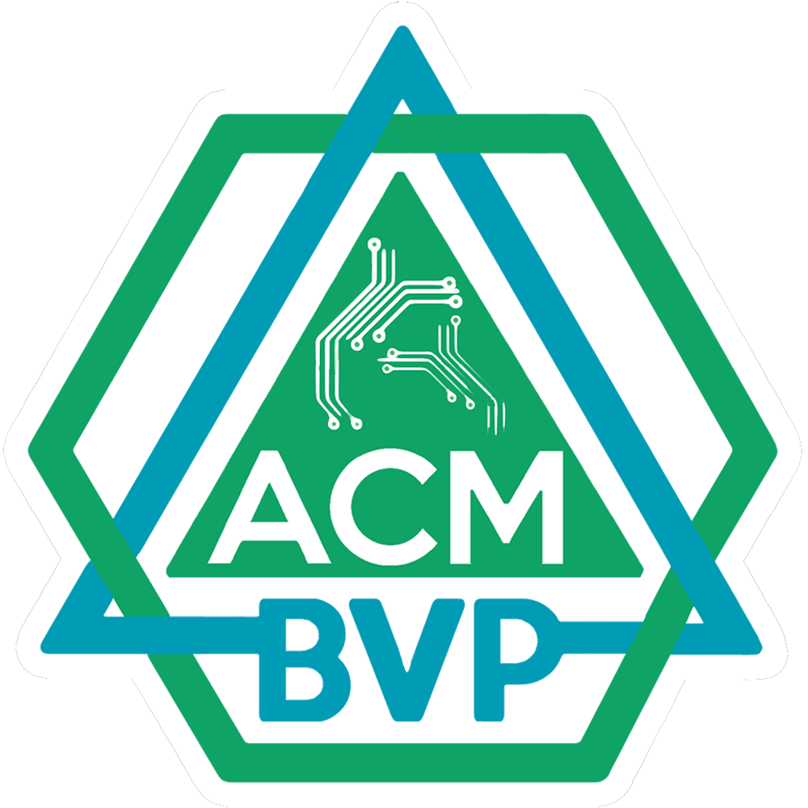

<br />
<p align="center">
  <a href="https://bvcoe.acm.org">
    
  </a>

  <h3 align="center">Official ACM BVP Website</h3>

  <p align="center">
    <a href="https://www.codacy.com/manual/dakshkhetan/acm-bvp-website/dashboard?utm_source=github.com&amp;utm_medium=referral&amp;utm_content=dakshkhetan/acm-bvp-website&amp;utm_campaign=Badge_Grade"></a>
    
    
  </p>

  <p align="center">
    <a href="https://bvcoe.acm.org">Website</a>
  </p>
</p>

## Quick Start :rocket:

Start the project locally.

### Step 1: Clone the repo

Fork the repository, then clone the repo locally by running command:

```sh
git clone https://github.com/dakshkhetan/acm-bvp-website.git
```

### Step 2: Install dependencies

cd into the directory:

```sh
cd acm-bvp-website
```

In the root folder do `yarn` or `npm install` _(depending upon your package manager)_:

```sh
yarn
# or
npm install
```

#### And you're good to go!

```sh
yarn start
# or
npm start
```

## Project Structure :open_file_folder:

```
📦src
 ┣ 📂assets
 ┃ ┣ 📂acm-logo
 ┃ ┣ 📂display-pics
 ┃ ┣ 📂dsp-sessions
 ┃ ┣ 📂dsp-speakers
 ┃ ┣ 📂gallery
 ┃ ┣ 📂illustrations
 ┃ ┣ 📂technology
 ┃ ┣ 📂worskshop-section
 ┣ 📂components
 ┃ ┣ 📂ACM-W
 ┃ ┃ ┣ 📂About
 ┃ ┃ ┣ 📂Accomplishments
 ┃ ┃ ┣ 📂Hero
 ┃ ┃ ┣ 📂RoadAhead
 ┃ ┃ ┗ 📂Vision
 ┃ ┣ 📂Backdrop
 ┃ ┣ 📂Carousel
 ┃ ┣ 📂CodeOfConduct
 ┃ ┣ 📂Contact
 ┃ ┣ 📂DSP
 ┃ ┃ ┣ 📂Hero
 ┃ ┃ ┣ 📂Sessions
 ┃ ┃ ┣ 📂Speakers
 ┃ ┣ 📂Divisions
 ┃ ┣ 📂FAQs
 ┃ ┣ 📂Footer
 ┃ ┣ 📂Header
 ┃ ┣ 📂Hero
 ┃ ┣ 📂LatestTrends
 ┃ ┣ 📂Person
 ┃ ┣ 📂SideDrawer
 ┃ ┣ 📂Team
 ┃ ┣ 📂Toggle
 ┃ ┗ 📂Workshops
 ┣ 📂data
 ┃ ┣ 📜accomplishments.data.js
 ┃ ┣ 📜faq.data.js
 ┃ ┣ 📜team.data.js
 ┃ ┗ 📜workshops.data.js
 ┣ 📂pages
 ┃ ┣ 📂ACM-W
 ┃ ┣ 📂Events
 ┃ ┗ 📂Home
 ┣ 📂redux
 ┃ ┣ 📂dark-mode
 ┃ ┃ ┣ 📜dark-mode.action.js
 ┃ ┃ ┣ 📜dark-mode.reducer.js
 ┃ ┃ ┗ 📜dark-mode.types.js
 ┃ ┣ 📜root.reducer.js
 ┃ ┗ 📜store.js
 ┣ 📜App.jsx
 ┣ 📜index.css
 ┗ 📜index.js
```

## Contributing :v:

After cloning & setting up the local project you can push the changes _(fixes, features, etc.)_ to your GitHub fork and make a pull request.

### Pushing the changes

```bash
git add .
git commit -m "feature: add XYZ"
git push <YOUR_FORKED_REPO_URL> <YOUR_BRANCH_NAME>
```

---

Made with :heart: by [Daksh Khetan](https://dakshkhetan.now.sh/).
